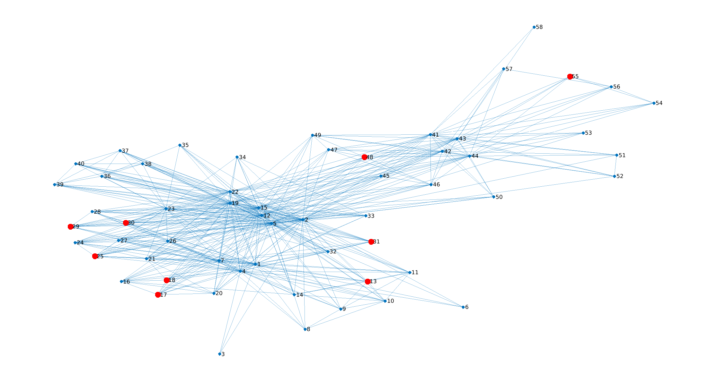
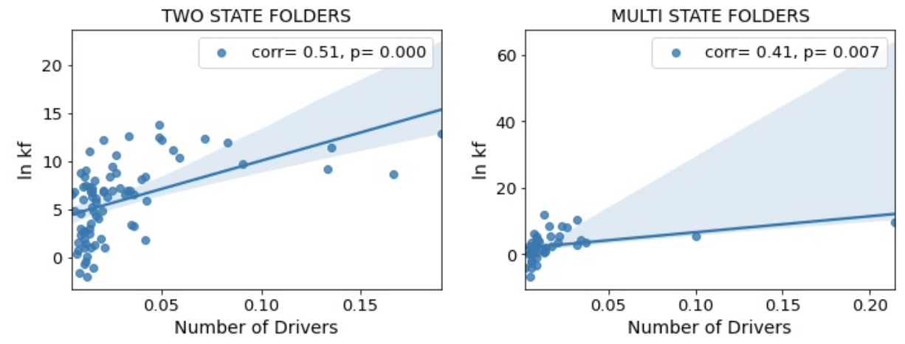

# Exact Controllability of Protein-Folding Networks

Computational analysis of **controllability in complex networks**, with a focus on protein structure and protein-folding networks.

This project investigates how the topology of a complex interaction network determines which nodes must be controlled in order to steer the system toward a desired state. The analysis combines concepts from **control theory, network science, dynamical systems, and computational biology**.

## Overview on optimal control

Many complex systems can be represented as networks in which nodes describe interacting components and edges encode their interactions.

For a dynamical system defined on a network,

$$
\dot{\mathbf{x}} = A\mathbf{x} + B\mathbf{u},
$$

the matrix $A$ describes interactions between nodes, while $B$ determines where external control signals are applied.

A central question is:

> **Which nodes must be controlled in order to make the entire network controllable?**

This repository explores this problem computationally, particularly for **protein residue-interaction networks**, where nodes represent amino-acid residues and edges describe structural interactions between them.

The goal is to identify important **driver nodes** and investigate how network topology influences controllability and potentially relates to protein-folding properties.

## Main Topics

The project explores several aspects of network controllability:

- exact and structural controllability;
- identification of driver nodes;
- controllability of complex interaction networks;
- maximum-matching approaches;
- control-energy considerations;
- network topology and controllability;
- protein residue-interaction networks;
- comparison of alternative node-selection strategies;
- relationship between network-control properties and protein folding.

## Mathematical Background

Consider a linear time-invariant dynamical system

$$
A\mathbf{x}(t)
+
B\mathbf{u}(t),
$$

where

- $\mathbf{x}(t)\in\mathbb{R}^{N}$ is the state of the network,
- $A\in\mathbb{R}^{N\times N}$ is the interaction or adjacency matrix,
- $B$ specifies the controlled nodes,
- $\mathbf{u}(t)$ represents external control signals.

For a finite-dimensional linear system, controllability can be analyzed through the controllability matrix

$$
\begin{bmatrix}
B & AB & A^2B & \cdots & A^{N-1}B
\end{bmatrix}.
$$

The system is controllable when

$$
\mathrm{rank}(\mathcal{C}) = N.
$$

In large complex networks, directly analyzing this condition can become computationally expensive and sensitive to the precise values of the interaction weights.

Network-based approaches therefore provide additional tools for studying controllability from the underlying graph structure.

## Structural Controllability

Structural controllability asks whether a system is controllable for almost all choices of nonzero interaction strengths consistent with a given network topology.

A central computational approach is based on **maximum matching**.

For a directed representation of the network:

1. a maximum matching is identified;
2. nodes that remain unmatched are interpreted as candidate **driver nodes**;
3. external control signals applied to these nodes can structurally control the network under the corresponding assumptions.

The number and location of driver nodes therefore provide information about how easily a given network can be controlled.

## Driver Nodes

A major objective of this project is to identify nodes whose control has a disproportionate influence on the dynamics of the entire system.

Different network-control approaches can generate different sets of important nodes.

Methods investigated in this project include concepts related to:

- maximum matching;
- structural controllability;
- minimum-energy control;
- feedback vertex sets;
- minimum dominating sets.

These approaches provide complementary ways of asking which components of a network are most relevant for controlling its global dynamics.

## Protein Networks

Proteins provide a natural example of a high-dimensional interacting system.

A protein structure can be represented as a graph

$$
G=(V,E),
$$

where

- $V$ represents amino-acid residues;
- $E$ represents interactions or spatial contacts between residues.

The resulting residue-interaction network captures structural information about the protein while allowing graph-theoretic and control-theoretic methods to be applied.

The computational workflow can be summarized as

```text
Protein structure
       ↓
Residue-interaction network
       ↓
Adjacency / interaction matrix
       ↓
Network controllability analysis
       ↓
Driver-node identification
       ↓
Network-control metrics
       ↓
Comparison with protein-folding properties
```

## Research Questions

The project is motivated by questions such as:

- How many nodes must be externally controlled to control a protein interaction network?
- Where are the corresponding driver nodes located?
- How does network topology affect controllability?
- Do different controllability criteria identify similar important residues?
- How does the required control effort depend on network structure?
- Are network-control properties associated with protein-folding behavior?

## Control Energy

Controllability alone determines whether a target state can theoretically be reached.

In practice, another important quantity is the amount of control effort required.

A quadratic control cost can be written as

$$
E =
\int_0^T
\mathbf{u}^{\mathrm T}(t)
\mathbf{u}(t)
,dt.
$$

For a controllable linear system, minimum-energy control can be analyzed using the controllability Gramian,

$$
\int_0^T
e^{A(T-\tau)}
BB^{\mathrm T}
e^{A^{\mathrm T}(T-\tau)}
,d\tau.
$$

The Gramian provides information not only about whether the system is controllable but also about how difficult different directions in state space are to reach.

This distinction is important for complex biological networks: two networks may both be controllable while requiring very different amounts of control effort.

## Computational Workflow

The analysis follows a general pipeline:

```text
Network construction
        ↓
Graph characterization
        ↓
Controllability formulation
        ↓
Maximum-matching / driver-node analysis
        ↓
Alternative node-selection strategies
        ↓
Control-energy analysis
        ↓
Statistical comparison across networks
        ↓
Biological interpretation
```

## Methods

The project combines techniques from several areas.

### Control Theory

- controllability analysis;
- controllability matrices;
- controllability Gramians;
- minimum-energy control;
- linear dynamical systems.

### Network Science

- graph representations;
- adjacency matrices;
- maximum matching;
- driver-node identification;
- network topology analysis.

### Computational Biology

- protein residue-interaction networks;
- structural representation of proteins;
- comparison of network properties across proteins;
- analysis of relationships between network structure and folding behavior.

### Numerical Analysis

- matrix computations;
- eigenvalue and rank analysis;
- numerical linear algebra;
- optimization;
- statistical comparison and visualization.

## Technologies

The project uses scientific-computing tools for numerical and network analysis, including Python-based workflows for:

- numerical linear algebra;
- graph analysis;
- optimization;
- statistical analysis;
- data visualization;
- interactive computational experiments.

Typical libraries useful for reproducing the analysis include:

```text
NumPy
SciPy
NetworkX
Matplotlib
pandas
Jupyter
```


## Why Controllability Matters

Network topology does more than determine which components interact.

It also determines how perturbations and control signals propagate through the system.

Controllability analysis therefore provides a framework for connecting

$$
\text{network structure}
\quad\longrightarrow\quad
\text{dynamical influence}
\quad\longrightarrow\quad
\text{system-level behavior}.
$$

In biological systems, this perspective can help identify structurally important components that have a strong influence on collective dynamics.

# Driver Nodes in Protein Folding Networks

**How many components of a protein's interaction network would you need to control to steer the whole network, and does that number relate to how fast the protein folds?**

I compared three network-control methods on protein contact maps and circuit-topology networks of 100+ two-state and multi-state folding proteins, then tested whether each protein's driver-node fraction correlates with its folding rate.


*Circuit-topology network of a6n (58 nodes). Exact controllability identifies 9 driver nodes (red): controlling these is enough to steer the linear dynamics of the whole network.*

## Key findings

- **The answer depends strongly on the method.** On the same 765-node network, exact (linear) controllability needs 138 driver nodes, feedback vertex set control needs 522, and minimum dominating set control needs only 8.
- **On circuit-topology networks, driver-node fraction tracks folding rate.** Minimum dominating set: Pearson r = 0.51 (two-state, p < 0.001) and 0.41 (multi-state, p = 0.007); Spearman ρ = 0.58 and 0.67. Feedback vertex set shows the opposite sign (r ≈ −0.4).
- **On residue contact maps the link is weak or absent** (|r| ≤ 0.37; none for feedback vertex set).
- **Two-state and multi-state folders differ only modestly** in their driver-node distributions.

These results are exploratory. See [Limitations](#limitations).


*Minimum dominating set driver-node fraction vs. ln k<sub>f</sub> on circuit-topology networks, for two-state (left) and multi-state (right) folders.*

## Results

**Driver nodes needed by each method** (circuit-topology networks):

| Network | Nodes | Exact controllability | Feedback vertex set | Minimum dominating set |
|---|---:|---:|---:|---:|
| a6n | 58 | 9 (16%) | 38 (66%) | 2 (3%) |
| aps | 38 | 5 (13%) | 33 (87%) | 1 (3%) |
| chromosome | 765 | 138 (18%) | 522 (68%) | 8 (1%) |

**Correlation of driver-node fraction with folding rate** (Pearson r with ln k<sub>f</sub>, p in brackets):

| Network type | Method | Two-state folders | Multi-state folders |
|---|---|---:|---:|
| Contact maps | Exact controllability | 0.25 (0.026) | 0.32 (0.041) |
| Contact maps | Feedback vertex set | 0.16 (0.15) | −0.08 (0.61) |
| Contact maps | Minimum dominating set | 0.27 (0.016) | 0.37 (0.020) |
| Circuit topology | Feedback vertex set | −0.41 (< 0.001) | −0.43 (0.005) |
| Circuit topology | Minimum dominating set | 0.51 (< 0.001) | 0.41 (0.007) |

Full figures, distributions and discussion are in the [report](Control%20Principles%20of%20Complex%20Networks.pdf).

## Data

- **Residue contact maps:** nodes are amino-acid residues, and edges connect residues in spatial contact.
- **Circuit-topology matrices:** nodes are contacts, and edges encode whether two contacts are arranged in series (S), in parallel (P) or crossed (X). The S, P and X weights are model parameters; the report compares several settings.
- **Folding rates:** ln k<sub>f</sub> for proteins classified as two-state or multi-state folders.

<!-- TODO: name the source of the contact maps, circuit-topology matrices and folding-rate data, and give exact protein counts (two-state / multi-state). -->

The protein network matrices are not included in this repository.

## Methods

Each method answers "which nodes must receive a control signal?" under different assumptions:

| Method | Assumes | Driver nodes are |
|---|---|---|
| Exact controllability (linear) | Linear dynamics, known edge weights | Nodes needed for full rank in the PBH test |
| Feedback vertex set (nonlinear) | Nonlinear dynamics; only the network structure matters | Nodes whose removal breaks every cycle |
| Minimum dominating set (nonlinear) | Each driver controls its neighbours directly | Smallest set adjacent to every other node |

**Exact controllability, as implemented in [`PBH.ipynb`](PBH.ipynb).** For an undirected network with symmetric adjacency matrix $A$, the minimum number of driver nodes is the largest geometric multiplicity of any eigenvalue of $A$ (Yuan et al., 2013):


$N_D = \max_i \left[ N - \operatorname{rank}\left(\lambda_i I_N - A\right) \right]$


To find which nodes are drivers, the notebook takes the eigenvalue $\lambda_M$ that attains this maximum and row-reduces $A - \lambda_M I_N$. Nodes whose columns are not pivot columns are linearly dependent on the others, and they are the driver nodes.

On the notebook's 6-node example network, this gives 2 driver nodes (nodes 2 and 5). A Kalman rank test confirms that controlling these two nodes makes the network fully controllable (rank 6 of 6).

## Repository contents

| File | What it is |
|---|---|
| [`PBH.ipynb`](PBH.ipynb) | Exact-controllability implementation: driver-node count and identification, with a worked example |
| [`Control Principles of Complex Networks.pdf`](Control%20Principles%20of%20Complex%20Networks.pdf) | 11-page report: theory, all three methods and full results |
| `figures/` | Figures used in this README, taken from the report |

The feedback vertex set and minimum dominating set analyses in the report used integer linear programming code that is not included here.

<!-- TODO: confirm who wrote the FVS / MDS code, and credit collaborators or your supervisor under "Context". -->

## Run it

```bash
git clone https://github.com/laya-laya/Exact-controllability.git
cd Exact-controllability
python -m pip install numpy scipy pandas networkx sympy matplotlib seaborn jupyter
jupyter notebook PBH.ipynb
```

The worked example runs as is. The cells that load `a6n.csv` and `Book2.csv` need those matrices, which are not in this repository.

## Limitations

- **Exploratory statistics.** The report reports ten correlations without correcting for multiple testing, and some fits are driven by a few outlying proteins.
- **Possible confounding.** Feedback vertex set and minimum dominating set give opposite-signed correlations on the same networks. Both may partly reflect network size or contact density, which are known to relate to folding rate. The next step would be to control for chain length and contact order.
- **Inflated feedback vertex sets.** Undirected networks were mapped to bidirected ones, so every edge forms a cycle, which inflates the number of driver nodes this method needs.
- **Numerical sensitivity.** Exact controllability relies on numerical rank with a tolerance and on rounding eigenvalues, which can be fragile for large or near-degenerate networks.

## Context

This work was part of my MSc research at Sharif University of Technology. It brings together control theory, network science and protein biophysics.

## References

1. Yuan, Z., Zhao, C., Di, Z., Wang, W.-X. & Lai, Y.-C. Exact controllability of complex networks. *Nature Communications* 4, 2447 (2013).
2. Liu, Y.-Y. & Barabási, A.-L. Control principles of complex systems. *Reviews of Modern Physics* 88, 035006 (2016).
3. Mochizuki, A., Fiedler, B., Kurosawa, G. & Saito, D. Dynamics and control at feedback vertex sets II. *Journal of Theoretical Biology* 335, 130–146 (2013).
4. Nacher, J. C. & Akutsu, T. Dominating scale-free networks with variable scaling exponent: heterogeneous networks are not difficult to control. *New Journal of Physics* 14, 073005 (2012).
5. Mashaghi, A., van Wijk, R. J. & Tans, S. J. Circuit topology of proteins and nucleic acids. *Structure* 22, 1227–1237 (2014).

## Author

**Laya Parkavousi**, data scientist with a PhD in physics (Max Planck Institute for Dynamics and Self-Organization).
[GitHub](https://github.com/laya-laya) · [LinkedIn](https://www.linkedin.com/in/laya-parkavousi-7b394113b/) · [Google Scholar](https://scholar.google.com/citations?user=kpUdypcAAAAJ)

## License

MIT. See [LICENSE](LICENSE).

